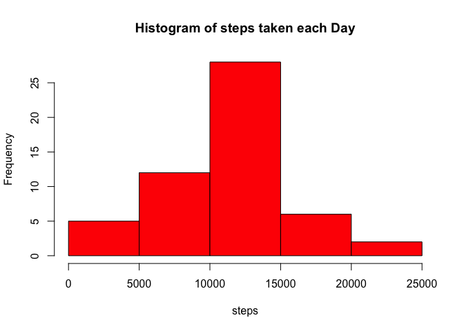
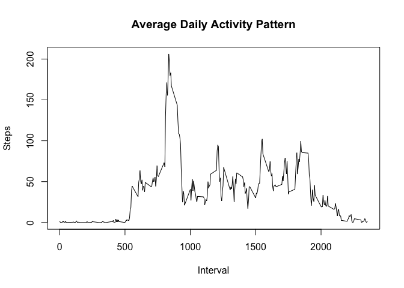
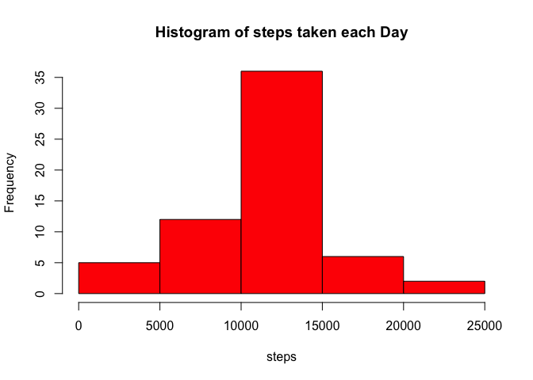

# Reproducible Research: Peer Assessment 1
##  This assignment makes use of data from a personal activity monitoring device.
##  The monitoring device collects data at 5 minute intervals.
##  The data consists of two months of data from an anonymous individual collected during the                                            
##  months of October and November, 2012 and include the number of steps taken
##  in 5 minute intervals each day.

## Loading and preprocessing the data

```r
library(dplyr)
```

```
## 
## Attaching package: 'dplyr'
## 
## The following object is masked from 'package:stats':
## 
##     filter
## 
## The following objects are masked from 'package:base':
## 
##     intersect, setdiff, setequal, union
```

```r
library(ggplot2)
```

```
## Warning: package 'ggplot2' was built under R version 3.1.3
```

```r
library(lattice)
mon_data <- read.csv("activity.csv", header=TRUE, sep=",")
```

## What is mean total number of steps taken per day?

```r
total_steps <- sum(mon_data$steps, na.rm=TRUE)
total_steps 
```

```
## [1] 570608
```
## Histogram of steps taken each day

```r
##  Group and summarize the data by day
day_data <- group_by(mon_data, date)
##day_sum <- summarize(day_data, steps=sum(steps,na.rm=TRUE))
day_sum <- summarize(day_data, steps=sum(steps))

##  Create histogram of number of steps taken per day
##
hist(day_sum$steps, main="Histogram of steps taken each Day", 
     xlab="steps", ylab="Frequency", col ="red")
```

 
## Mean and Median Steps each Day

```r
##  Report mean and median of all observations
mean_all <- mean(day_sum$steps, na.rm=TRUE)
median_all <- median(day_sum$steps, na.rm=TRUE)
mean_all
```

```
## [1] 10766.19
```

```r
median_all
```

```
## [1] 10765
```

```r
##                                                     
```


## What is the average daily activity pattern?

```r
##  Calculate the Average Daily Activity Pattern
intvl_data <- group_by(mon_data, interval)
##intvl_sum <- summarize(intvl_data, steps=mean(steps))
intvl_sum <- summarize(intvl_data, steps=mean(steps, na.rm=TRUE))

##                                                     
##  Plot of the average Daily Activity Pattern
with(intvl_sum, plot(interval, steps, type="l",
                   ylab="Steps", xlab="Interval"))
title(main="Average Daily Activity Pattern")
```

 
## Which 5 minute interval has the maximum # of steps?

```r
##                                                     
##  Which 5 Minute Interval across the days contains the maximum number of steps
max_steps <- max(intvl_sum$steps)
max_steps
```

```
## [1] 206.1698
```

```r
##  Loop thru the file to identify the interval containing the maximum value
for (i in 1:288) 
  {
  if (intvl_sum$steps[i] == max_steps)
  intvl_of_max_steps <- intvl_sum$interval[i]
  }
intvl_of_max_steps
```

```
## [1] 835
```

## Total Missing values in Dataset

```r
##  Calculate the number of observations with missing values
num_of_missing <- sum(is.na(day_data))
num_of_missing
```

```
## [1] 2304
```


## Histogram with missing values substiuted with averages for the interval

```r
##  Fill in Missing Values with the mean of the 5 minute interval averaged over the days.
## Subset Rows that have missing data
miss_data <-  subset(mon_data,(is.na(day_data)))
## Subset Rows that do not have missing data
## non_miss_data <-  subset(mon_data, mon_data$steps >= 0)

## Merge Rows with missing data with Average Daily Activity Pattern by 5 Minute Interval
merged_data <- merge(miss_data, intvl_sum, by.x="interval", by.y="interval")
## Remove x.interval steps variable
merged_data <- select(merged_data, -(steps.x))
## Rename y.interval variable
merged_data <- rename(merged_data, steps = steps.y)

## Subset Rows that do not have missing data
non_miss_data <-  subset(mon_data, mon_data$steps >= 0)

##Combine the missing observations with non-missing observations
combined_data <- rbind(merged_data, non_miss_data)

##  Group and summarize the data by day
new_data <- group_by(combined_data, date)
##day_sum <- summarize(day_data, steps=sum(steps,na.rm=TRUE))
day2_sum <- summarize(new_data, steps=sum(steps))

##  Create histogram of number of steps taken per day
##
hist(day2_sum$steps, main="Histogram of steps taken each Day", 
     xlab="steps", ylab="Frequency", col ="red")
```

 

## New Mean and Median with substitiuted missing values

```r
##  Report mean and median of all observations
mean2_all <- mean(day2_sum$steps)
median2_all <- median(day2_sum$steps)
mean2_all
```

```
## [1] 10766.19
```

```r
median2_all
```

```
## [1] 10766.19
```


## Are there differences in activity patterns between weekdays and weekends?

```r
##  Convert Date in new Combined File to Date Type
new_data$date <- as.Date(strptime(new_data$date, format="%Y-%m-%d")) 
##Create new variable day to classify
new_data$day <- weekdays(new_data$date)
# Assign day to proper classification
for (i in 1:nrow(new_data)) {                                      
  if (new_data[i,]$day %in% c("Saturday","Sunday")) {             
    new_data[i,]$day<-"weekend"                              
  }
  else{
    new_data[i,]$day<-"weekday"                                 #    else 'weekday'
  }
}


## Summarize the Data over the 5 minute Interval for Weeddays and Weekends
##  Calculate the Average Daily Activity Pattern
intvl2_data <- group_by(new_data, interval,day)
##intvl2_sum <- summarize(intvl2_data, steps=mean(steps))
intvl2_sum <- summarize(intvl2_data, steps=mean(steps))

## Plot comparing Weekdays vs Weekends using New Combined Data Set
xyplot(intvl2_sum$steps ~ intvl2_sum$interval | intvl2_sum$day, 
       layout = c(1, 2), type = "l", 
       xlab = "Interval", ylab = "Number of steps")
```

 


